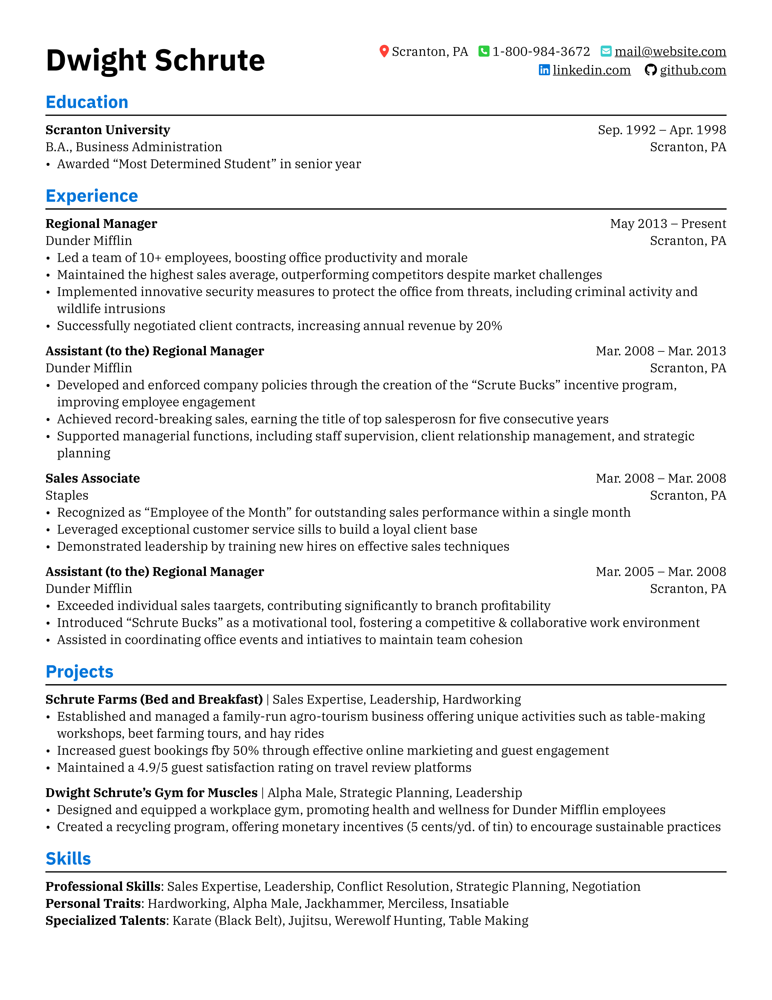
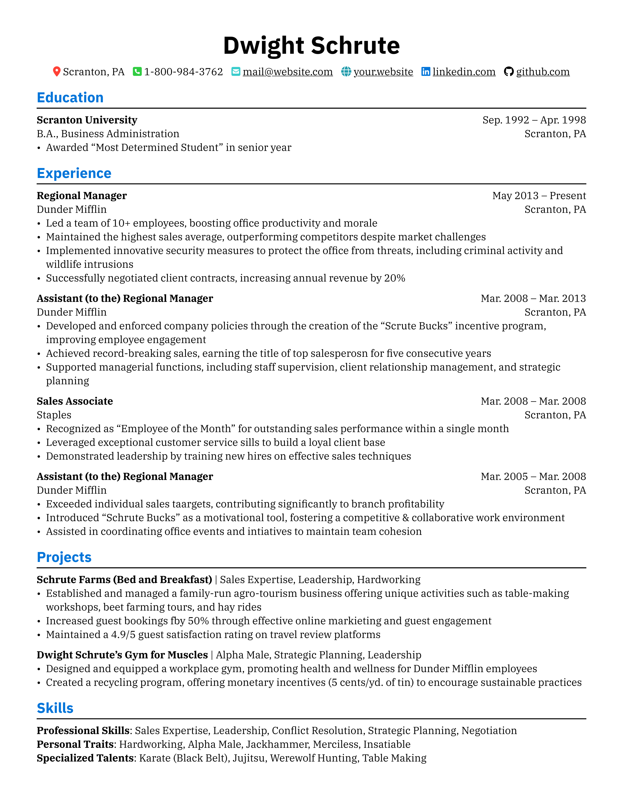

# mile-resume

A simple and easy-to-maintain resume template written in Typst.

This template is mainly just to indulge myself, as it's what I'd want in a resume - also, it gave me an opportunity to dive into a little bit of scripting with Typst, which isn't something I've tried before. If you do end up using this template, though, please let me know!

## How to use

### On the Typst website

1. Go to `typst.app`
2. Start a new project and copy all of the files from the `typst-app` folder into the project
3. You're good to go!

### Compiling locally

1. Navigate into the `local` folder
2. Edit `resume.typ` to your heart's content
3. Use `make` to compile or `make watch` to automatically recompile upon changes
4. Marvel at `resume.pdf` in all of its glory...

## Examples
There are two different name/contact info headers. The first is a condensed version, with the name and contact information taking up the same horizontal space:

and the other is a more traditional layout, like what you would see on Jake's Resume:

I personally like the first one more, as it was more fun to make, and I think it looks nicer (it's the one I use on mine). However the traditional layout is tried-and-true and that's how it is on basically every other popular resume template out there, so I figured I might as well include it. Feel free to use whichever one you think looks nicer!

## Acknowledgements

- chicv (https://github.com/skyzh/chicv): the template I used previously and took heavy inspiration from for this one
- simple-technical-resume (https://typst.app/universe/package/simple-technical-resume/): provided me with some mildly amusing filler text since I didn't want to doxx my whole resume for the examples for free
- fontawesome (https://typst.app/universe/package/fontawesome/): fontawesome for providing the icons, and duskmoon for this wonderful package that actually lets me use them in the document!
